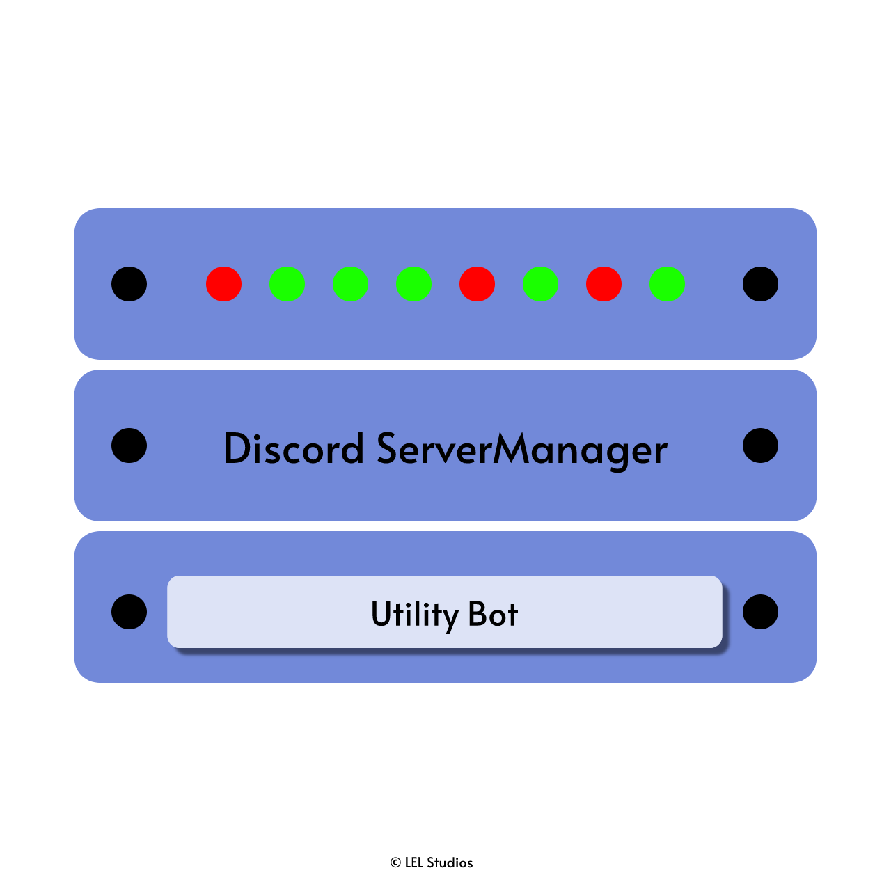

# Discord-ServerManager Utility Bot

ServerManager is a bot aimed to help admins, moderators, staffs and server owners in Discord servers. You will have to host the bot on your own. The Bot is currently in beta or in development stage as many call it, therefore features may be unstable or unusable. ServerManager will be open source licensed under the MIT License, see in LICENSE. LEL Studios is the current developer of the Bot, make sure to check our other projects on GitHub at https://github.com/LEL-Studios.
___

## LICENSE
MIT License

Copyright (c) 2021 lucaso60
Copyright (c) 2021 LEL Studios

Permission is hereby granted, free of charge, to any person obtaining a copy
of this software and associated documentation files (the "Software"), to deal
in the Software without restriction, including without limitation the rights
to use, copy, modify, merge, publish, distribute, sublicense, and/or sell
copies of the Software, and to permit persons to whom the Software is
furnished to do so, subject to the following conditions:

The above copyright notice and this permission notice shall be included in all
copies or substantial portions of the Software.

THE SOFTWARE IS PROVIDED "AS IS", WITHOUT WARRANTY OF ANY KIND, EXPRESS OR
IMPLIED, INCLUDING BUT NOT LIMITED TO THE WARRANTIES OF MERCHANTABILITY,
FITNESS FOR A PARTICULAR PURPOSE AND NONINFRINGEMENT. IN NO EVENT SHALL THE
AUTHORS OR COPYRIGHT HOLDERS BE LIABLE FOR ANY CLAIM, DAMAGES OR OTHER
LIABILITY, WHETHER IN AN ACTION OF CONTRACT, TORT OR OTHERWISE, ARISING FROM,
OUT OF OR IN CONNECTION WITH THE SOFTWARE OR THE USE OR OTHER DEALINGS IN THE
SOFTWARE.

## Instructions
- Download Python from https://python.org
- Download pycord - `pip install py-cord`
- Run the `launcher.py` file

## Contact
📫You can see our contact information on our GitHub page. 📫